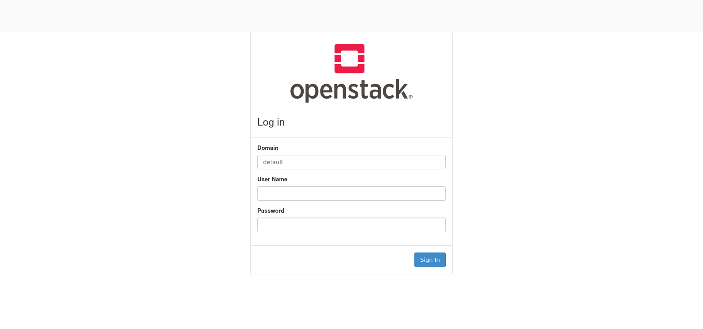

Add this helm repo:

```
helm repo add osh https://charts.kupenstack.io
```

# OSH-Charts

OpenStack-Helm charts repository. 

Generated using upstream repository:

* [github.com/openstack/openstack-helm](https://github.com/openstack/openstack-helm)
* [github.com/openstack/openstack-helm-infra](https://github.com/openstack/openstack-helm-infra)

------

The Openstack-Helm project provides a collection of Helm charts that simply, resiliently, and flexibly deploy OpenStack as containers on Kubernetes. KupenStack uses Openstack-Helm charts for deploying and managing Openstack cluster. In this page we will look at how to manually deploy these helm charts to deploy Openstack cluster on Kubernetes.

Tabel of contents:

* [Before we begin](#Before-we-begin)
* [Deploy Ingress](#Deploy-Ingress)
* [Deploy Mariadb](#Deploy-Mariadb)
* [Deploy Memcached](#Deploy-Memcached)
* [Deploy RabbitMQ](#Deploy-RabbitMQ)
* [Deploy Keystone](#Deploy-Keystone)
* [Deploy Glance](#Deploy-Glance)
* [Deploy Horizon](#Deploy-Horizon)
* [Deploy Libvirt, Neutron, Nova, Placement](#Deploy-Libvirt,-Neutron,-Nova,-Placement)
* [Using Horizon Dashboard](#Using-Horizon-Dashboard)

### Before we begin

Before we begin, we need to have a kubernetes cluster on top of which we will deploy Openstack. For this tutorail we will use kind for deploying k8s cluster. Also, note that we are using k8s version 1.19.

Deploy k8s cluster using command:

```
kind create cluster --image kindest/node:v1.21.1
```

Now, we will add few labels to our k8s nodes:

We will add label `openstack-control-plane=enabled` to all control nodes we want to keep. `linuxbridge=enabled` label to nodes that we want to keep linux bridge as provider for networking. And `openstack-compute-node=enabled` label to all nodes we want to keep as compute node.

In our case for single node kind cluster the commands will be as follow:

```
kubectl label node kind-control-plane openstack-control-plane=enabled;
kubectl label node kind-control-plane linuxbridge=enabled;
kubectl label node kind-control-plane openstack-compute-node=enabled
```

### Deploy Ingress

First we start by deploying ingress, 

Deploy ingress in namespace `kube-system`:

```
helm upgrade --install ingresskubesystem osh/ingress --namespace kube-system --values ingressKubeSystem.yaml 
```

Where `ingressKubesystem.yaml` has values:

```
deployment:
  mode: cluster
  type: DaemonSet
network:
  host_namespace: true
```

Create Openstack namespace:

```
kubectl create ns openstack
```

Deploy ingress in our openstack namespace:

```
helm upgrade --install ingress osh/ingress --namespace openstack
```

### Deploy Mariadb

`mariadb.yaml`:

```
pod:
  replicas:
    server: 1
    ingress: 1
volume:
  enabled: false
  use_local_path_for_single_pod_cluster:
    enabled: true
```

```
helm upgrade --install mariadb osh/mariadb --namespace openstack --values mariadb.yaml 
```

### Deploy Memcached

```
helm upgrade --install memcached osh/memcached --namespace openstack
```

### Deploy RabbitMQ

`rabbitmq.yaml`:

```
pod:
  replicas:
    server: 1
volume:
  enabled: false
```

```
helm upgrade --install rabbitmq osh/rabbitmq --namespace openstack --values rabbitmq.yaml
```

### Deploy Keystone

`keystone.yaml`:

```
pod:
  replicas:
    api: 1
```

```
helm upgrade --install keystone osh/keystone --namespace openstack --values keystone.yaml
```

### Deploy Glance

First we will have to create PV for glance to use:

`glance-pv.yaml`:

```
apiVersion: v1
kind: PersistentVolume
metadata:
  name: glance-pv
spec:
  storageClassName: general
  capacity:
    storage: 2Gi
  accessModes:
    - ReadWriteOnce
  hostPath:
    path: "/mnt/glance"

```

```
kubectl apply -f glance-pv.yaml
```

Then we install glance helm chart with values:

`glance.yaml`

```
storage: pvc
pod:
  replicas:
    api: 1
    registry: 1
```

```
helm upgrade --install glance osh/glance --namespace openstack --values glance.yaml 
```

### Deploy Horizon

`horizon.yaml`:

```
pod:
  replicas:
    server: 1
```

```
helm upgrade --install horizon osh/horizon --namespace openstack --values horizon.yaml
```

Let's add a nodeport to view horizon dashboard from outside the cluster.

```
kind: Service
apiVersion: v1
metadata:
  name: horizon-nodeport
  namespace: openstack
spec:
  type: NodePort
  ports:
    - port: 80
      nodePort: 32020
  selector:
    application: horizon
    component: server
```

```
kubectl apply -f horizon-nodeport.yaml
```

### Deploy Libvirt, Neutron, Nova, Placement

`libvirt.yaml`:

```
network:
  backend: 
    - linuxbridge
conf:
  ceph:
    enabled: false
```

```
helm upgrade --install libvirt osh/libvirt --namespace openstack --values libvirt.yaml
```

`neutron.yaml`:

```
network:
  backend: 
    - linuxbridge
conf:
  neutron:
    DEFAULT:
      interface_driver: linuxbridge
  dhcp_agent:
    DEFAULT:
      interface_driver: linuxbridge
  l3_agent:
    DEFAULT:
      interface_driver: linuxbridge
```

```
helm upgrade --install neutron osh/neutron --namespace openstack --values neutron.yaml
```

`nova.yaml`:

```
network:
  backend: 
    - linuxbridge
pod:
  replicas:
    osapi: 1
    conductor: 1
    consoleauth: 1
bootstrap:
  wait_for_computes:
    enabled: true
conf:
  ceph:
    enabled: false
  nova:
    libvirt:
      virt_type: qemu
      cpu_mode: none

manifests:
  cron_job_cell_setup: false
  cron_job_service_cleaner: false
  statefulset_compute_ironic: false
  deployment_placement: false
  ingress_placement: false
  job_db_init_placement: false
  job_ks_placement_endpoints: false
  job_ks_placement_service: false
  job_ks_placement_user: false
  pdb_placement: false
  secret_keystone_placement: false
  service_ingress_placement: false
  service_placement: false
```

```
helm upgrade --install nova osh/nova --namespace openstack --values nova.yaml
```

`placement.yaml`:

```
pod:
  replicas:
    api: 1
```

```
helm upgrade --install placement osh/placement --namespace openstack --values placement.yaml 
```

### Using Horizon Dashboard

Now our Openstack deployment is complete and we can use it. For viewing horizon in web browser we can view it on nodeIP:PortNumber which in our case we can get by:

```
kubectl get nodes -o wide
NAME                 STATUS   ROLES    AGE    VERSION   INTERNAL-IP   EXTERNAL-IP   OS-IMAGE                                     KERNEL-VERSION      CONTAINER-RUNTIME
kind-control-plane   Ready    master   166m   v1.19.1   172.18.0.2    <none>        Ubuntu Groovy Gorilla (development branch)   5.13.0-40-generic   containerd://1.4.0
```

Open `172.18.0.2:32020` in browser to see horizon dashboard:



To login use:

Domain: default

Username: admin

Password: password


